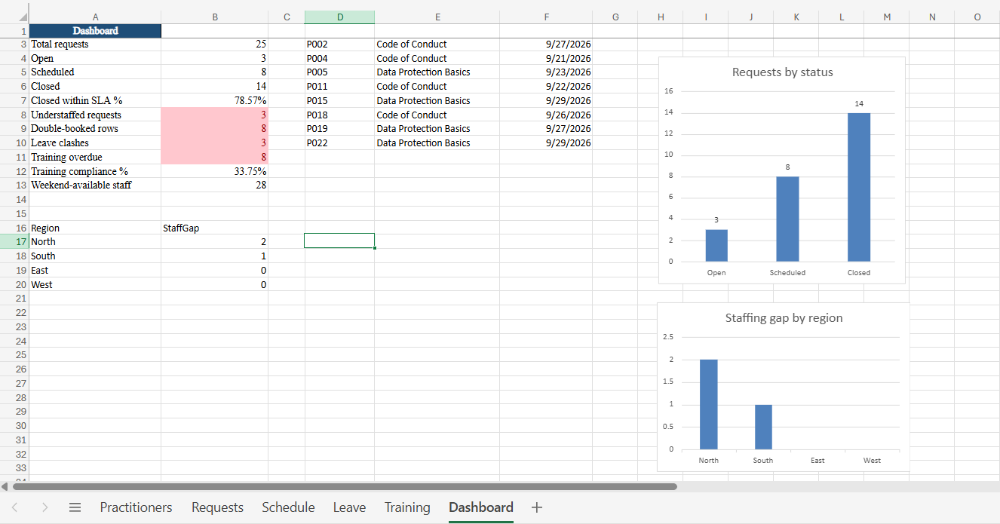

# ResourceOps Tracker

> An Excel-based Resource Management operations tracker with automated exception detection and a Python reporting layer.

ResourceOps Tracker is a personal project that simulates the day-to-day work of a Resource Management support team. It is designed to track practitioners, client-site stock-count requests, scheduling, leave, mandatory training, staffing requirements, and operational exceptions.

The project combines **Microsoft Excel** for day-to-day tracking and dashboard reporting with **Python** for independent validation and weekly exception reporting.

## Dashboard

The dashboard provides visibility into:

- Total requests and request status
- SLA performance
- Understaffed requests
- Double-booked practitioners
- Leave clashes
- Training compliance
- Overdue training
- Weekend staff availability
- Staffing gaps by region

## What It Does

- Tracks practitioners, requests, schedules, leave, and mandatory training
- Automatically flags double-bookings
- Detects practitioners scheduled during approved leave
- Identifies understaffed requests
- Calculates SLA ageing using working days
- Flags overdue mandatory training for follow-up
- Provides regional staffing-gap analysis
- Displays key operational metrics on a single dashboard
- Generates a weekly exceptions report using Python
- Validates Excel results independently through Python

## Workbook Structure

The workbook contains six sheets:

ResourceOps_Tracker.xlsx
│
├── Practitioners
├── Requests
├── Schedule
├── Leave
├── Training
└── Dashboard

The tables are linked using IDs rather than names:

PractID
   │
   ├── Practitioners
   ├── Schedule
   ├── Leave
   └── Training

RequestID
   │
   ├── Requests
   └── Schedule

# Testing & Validation

--->The project includes deliberately planted errors to test the exception logic.

# Validation results
7 of 7 planted error scenarios detected
0 false positives in the validation test
Excel and Python summaries matched across the tracked metrics
An additional test using 3 newly introduced errors resulted in 3 of 3 errors detected

# The sample dataset also demonstrates:

14 closed requests
78.6% closed within the 5-working-day SLA
8 training records requiring follow-up

The dashboard may display affected rows/records, while the planted-error test counts distinct scenarios. The answer-key CSV provides the ground truth used for validation.

# What I Learned
Data quality matters as much as reporting

A dashboard is only as reliable as the data behind it. Using IDs, controlled fields and validation rules helps reduce avoidable data-quality issues.

Independent validation improves confidence

Implementing the same business rules in Excel and Python makes it possible to compare outputs and identify discrepancies.

Automation needs to handle change

A reporting script can fail when the structure of a source workbook changes. Selecting only the required columns rather than relying on an exact fixed structure makes the process more robust.

Simple tools can support real operational workflows

Excel can support effective operational tracking when tables, validation, formulas, conditional formatting and dashboards are combined with clear data structures and repeatable processes.

# Weekly Workflow

1. Update the tracker

Add or update records directly in the relevant Excel Table.

2. Maintain IDs

Use PractID and RequestID consistently when linking records.

3. Review the Dashboard

Check the KPI section and investigate exception values requiring action.

4. Run the Python validation

python scripts/exceptions_report.py "data/ResourceOps_Tracker.xlsx"

5. Review the exceptions report

Use the generated report as a weekly action list for Resource Managers.

# What I Learned

Data quality matters as much as reporting

----> A dashboard is only as reliable as the data behind it. Using IDs, controlled fields and validation rules helps reduce avoidable data-quality issues.

Independent validation improves confidence

Implementing the same business rules in Excel and Python makes it possible to compare outputs and identify discrepancies.

Automation needs to handle change

A reporting script can fail when the structure of a source workbook changes. Selecting only the required columns rather than relying on an exact fixed structure makes the process more robust.

Simple tools can support real operational workflows

Excel can support effective operational tracking when tables, validation, formulas, conditional formatting and dashboards are combined with clear data structures and repeatable processes.

# Assumptions & Limitations

---> This project is a simulation designed to demonstrate operational tracking, data-quality controls and reporting.

Current assumptions include:

SLA target is 5 working days from request receipt to closure
Public holidays are not excluded from working-day calculations
Schedule records represent single-day assignments
Multi-day assignments are not currently modelled
All data is synthetic
Production resource-management systems would normally include more advanced capacity planning, forecasting and optimisation

# Technology Stack

Microsoft Excel
Excel Tables
Structured references
COUNTIFS
SUMIFS
FILTER
NETWORKDAYS
Data validation
Conditional formatting
Charts
Python
pandas
openpyxl
Faker
Version Control
Git
GitHub

# Setup

#Install the required Python packages:
pip install pandas faker openpyxl

# Generate the synthetic dataset:
--> python scripts/generate_data.py

# Project Purpose

--> This project demonstrates practical skills in:

Resource Operations · Data Quality · Excel Automation · Exception Management · Operational Reporting · Python Automation · Data Validation

The focus is on building a reliable operational tracker that can identify exceptions, support scheduling decisions, monitor compliance, and produce repeatable management reporting.
